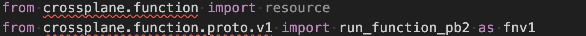

# configuration-aws-network-python

This is a port of the [AWS Network Configuration](https://github.com/upbound/configuration-aws-network/tree/main) to [embedded functions](https://docs.upbound.io/core-concepts/embedded-functions/).

* [configuration-aws-network-python](#configuration-aws-network-python)
  * [Prerequisites](#prerequisites)
  * [Creating the Project](#creating-the-project)
  * [Creating the Example](#creating-the-example)
  * [Creating the XRD](#creating-the-xrd)
  * [Add Dependencies](#add-dependencies)
  * [Creating the Initial Composition](#creating-the-initial-composition)
  * [Creating a Python Function](#creating-a-python-function)
  * [Creating a VirtualEnvironment (VEnv)](#creating-a-virtualenvironment-venv)

## Prerequisites

* An Upbound Account. [Register Here](https://accounts.upbound.io/register).
* The `up` CLI. [Download Instructions](https://docs.upbound.io/reference/cli/#install-the-up-command-line).
* Visual Studio Code

## Creating the Project

First, we create a project and enter the Directory

```shell
$ up project init configuration-aws-network-python
created directory path configuration-aws-network-python

initialized package "configuration-aws-network-python" in directory "configuration-aws-network-python" from https://github.com/upbound/project-template (main)

$ cd configuration-aws-network-python
```

## Creating the Example

A good place to start is defining the API for our network resource. We start
by creating an example network request and use it to scaffold the API definition.

We can use the [example](https://github.com/upbound/configuration-aws-network/blob/main/examples/kcl/network-xr.yaml) from the existing configuration as a guide.

```shell
$ up example generate --type=xr \
   --api-group=aws.platform.upbound.io \
   --api-version=v1alpha1 \
   --kind=XNetwork \
   --name=configuration-aws-network-python

Successfully created example and saved to /Users/username/code/configuration-aws-network-python/examples/xnetwork/configuration-aws-network-python.yaml
```

Note the generated example is stored as `examples/<Kind>/<example-name>.yaml`

Update the file in `xnetwork/configuration-aws-network-python.yaml` to have the
same input as the example file. It will look something like:

```yaml
apiVersion: aws.platform.upbound.io/v1alpha1
kind: XNetwork
metadata:
  name: configuration-aws-network-python
spec:
  id: configuration-aws-network
  region: us-west-2
  vpcCidrBlock: 192.168.0.0/16
  subnets:
    - availabilityZone: us-west-2a
      type: public
      cidrBlock: 192.168.0.0/18
    - availabilityZone: us-west-2b
      type: public
      cidrBlock: 192.168.64.0/18
    - availabilityZone: us-west-2a
      type: private
      cidrBlock: 192.168.128.0/18
    - availabilityZone: us-west-2b
      type: private
      cidrBlock: 192.168.192.0/18
```

## Creating the XRD

In Crossplane the platform API is known as a CompositeResourceDefinition or XRD.
We can now create the XRD from the example.

```shell
$ up xrd generate examples/xnetwork/configuration-aws-network-python.yaml

Successfully created CompositeResourceDefinition (XRD) and saved to /Users/username/code/configuration-aws-network-python/apis/xnetworks/definition.yaml
```

The Generated CompositeResourceDefinition is stored in the `apis/<Kind>/definition.yaml` file.

## Add Dependencies

The upstream project has a number of [dependencies](https://github.com/upbound/configuration-aws-network/blob/main/crossplane.yaml). We'll start by adding the
EC2 provider, which contains the components needed to provision an AWS network.

```shell
up dep add xpkg.upbound.io/upbound/provider-aws-ec2:v1.17.0

xpkg.upbound.io/upbound/provider-aws-ec2:v1.17.0 added to cache
xpkg.upbound.io/upbound/provider-aws-ec2:v1.17.0 added to project dependency
```

The package dependency has been added to the [upbound.yaml](upbound.yaml) file.

## Creating the Initial Composition

The Composition runs a series of steps to create desired state for our `XNetwork`.
We can generate the Composition scaffold from the XRD:

```shell
$ up composition generate apis/xnetworks/definition.yaml

successfully created Composition and saved to /Users/username/code/configuration-aws-network-python/apis/xnetworks/composition.yaml
```

Looking at the Composition we see it has one step, for [function-auto-ready](https://github.com/crossplane-contrib/function-auto-ready).

```yaml
apiVersion: apiextensions.crossplane.io/v1
kind: Composition
metadata:
  name: xnetworks.aws.platform.upbound.io
spec:
  compositeTypeRef:
    apiVersion: aws.platform.upbound.io/v1alpha1
    kind: XNetwork
  mode: Pipeline
  pipeline:
  - functionRef:
      name: crossplane-contrib-function-auto-ready
    step: crossplane-contrib-function-auto-ready
```

## Creating a Python Function

We will now create a template function. Ensure that the `--language` flag is set,
as the `up` command defaults to KCL. The name of my function starts with the Upbound
organization I am working with, `upboundcare`.

```shell
$ up function generate --language python upboundcare-compose-network

 ✓   Checking dependencies                                                                                       
  ✓   Generating Function Folder                                                                                  
successfully created Function and saved to /Users/username/code/configuration-aws-network-python/functions/upboundcare-compose-network

```

The function has been created in [functions/upboundcare-compose-network/main.py].

## Creating a VirtualEnvironment (VEnv)

You will notice the some of the libraries are not loading into the function.

We'll create a Python VEnv and have it update the requirements.



We can create a VEnv for the entire project or for a single function. In
our example we'll create the VEnv in the function directory using Visual Studio.

Note that a `requirements.txt` file has been generated that includes
our libraries:

```ini
crossplane-function-sdk-python==0.5.0
pydantic==2.9.2
```
